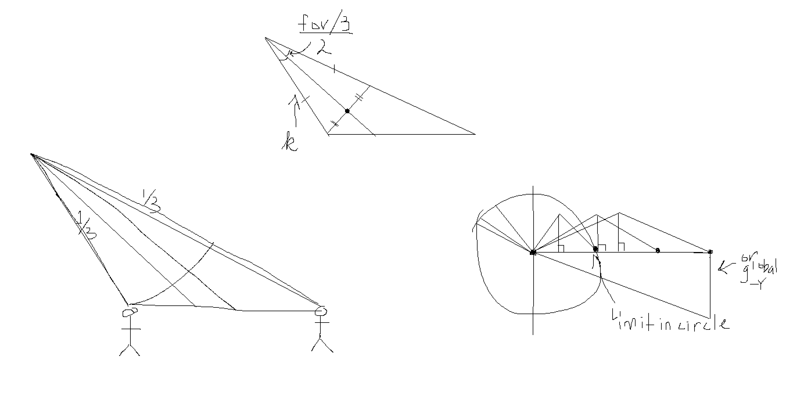
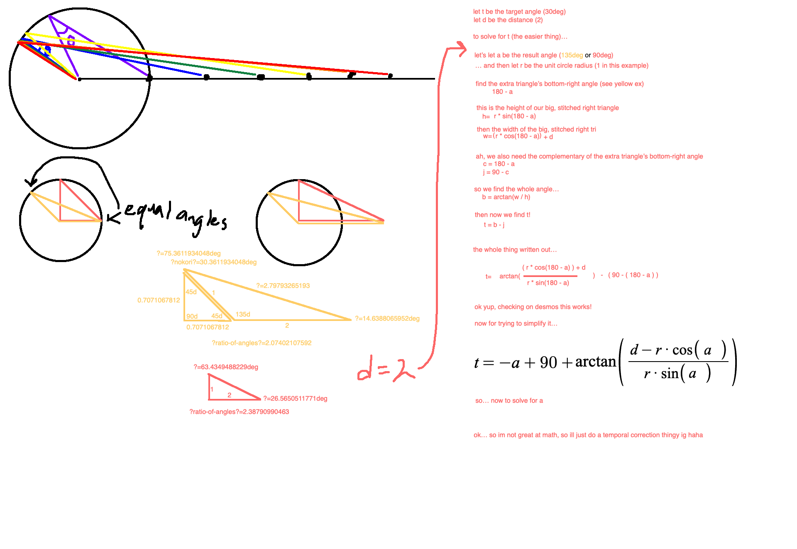
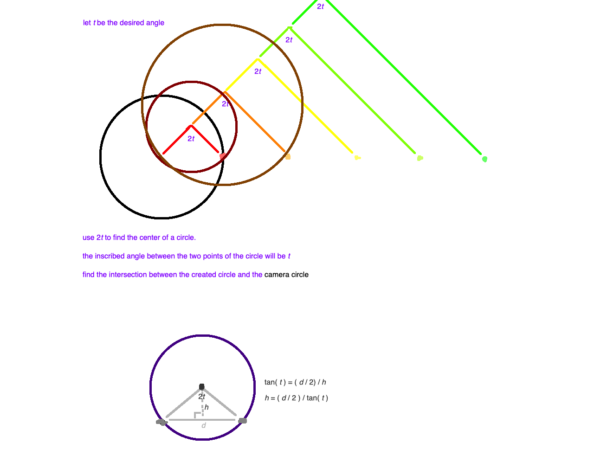

- [x] Get the physics_engine folder to not have any .txt files (make all the .cpp files compile correctly)
    - It doesn't seem toooo difficult, but there needs to be some work on getting this to use TXP_renderer instead.

- [x] Integrate the TXP renderer.

- [x] Add in deformed render models being disabled while `is_simulation_running` is false.

- [x] Fix asserts in creating physics objects.
    - It appears to be workign.

- [x] Fix input controlled character mvt (system).
    - Ummm that was ez. Like super duper ez.

- [x] do fixing up until afa required stuff.

- [x] make orbiting cam mode for input stuff.

- [x] do animated render models implementation in txp-renderer.
- [x] include afa implementation.

- [x] Implement the new txp-renderer into here.

- [x] Add a component type that allows for string of chars to signify rail system.

- [x] Create list of transforms imgui list/window.
    - [x] For some reaosn it's crashing w imguizmo?
        - possibly wrong version?
        - after updating the imguizmo version, it's still crashing... hmmm.
        - maybe setup is missing for imguizmo specifically???
    - [x] also show root objects that have component::Transform but no component::Trasfnorm_hierarchy component.
    - [x] Now imguizmo is just plain not showing up????
        - The draw context is 0x0 size for some reason???
        - I needed to do setRect()
        - Also, to have the correct state i needed to actually use matching versions of imgui and imguizmo.
    - [x] Insert imguizmo into the actual correct windows.
        - probably as some kind of callback or a list of requests maybe??
            - like giving a transform and then requesting the information back if it changed.
            - this could allow for many different gizmos to be drawn per view for bezier curves or smth. plus, no need to include the imguizmo headers in the game engine ig??
        - [x] remove imguizmo dependency.
    - [x] Fix stuff not moving for transforms without a transform hierarchy from imguizmo move!!
- [x] Create a simple imgui inspector for the component.
- [x] fix rename todo.

- [x] Have component draw multiple models of the rails in their positions.

- [x] Implement tilt rails to go into and out of curves.

- [x] Make component for riding rail lines (essentially having a whole ass train car system)
    - [x] make the riding on curve part
    - [x] fill in info
        - need constexpr construction funcs??
    - [x] fix issues with rider transform on the line.
    - [x] make rail line editor ctor use this same info instead of the hardcoded vals
    - Incomplete, but call it for now!!

- [x] Fix construction code change not causing the rail line to change. or is it just not deleting old entities?
    - maybe need to use the create_entity() and destroy_entity() funcs in the entity container?????
    - turns out the created entities were never listed. but... now there's hidden entities that wont show up in the object list. which for the rail line is probably fine but hey idk.
        - [x] make it explicit w comment or something that the creation method is meant to not show the rails on the object list.
    - [x] fix the renderer crashing code when the rails are rebuilt.
        - ig the old, stale rails shouldn't show up in `rend_obj_cfg_view`
    - Turns out it was a bad reordering algorithm when deleting stale render objects in the renderer

- [x] deadline: performance timer in txp-renderer

- [ ] ~~deadline: input direction with keyboard~~
    - Postponed until controller support and other stuff is going to get added.

- [x] make more train cars connecting for the riding rails
    - [x] ~~have 1 master bogie per car, then 1 trailing bogie~~ have list of bogies and offsets.
    - [ ] ~~master bogie either follows desired position or master bogie one car ahead~~
        - no this wouldn't work bc the position could be very different from one master to another.
        - it'll just have to be a bunch of masters (or rather just regular bogies) trailing behind the first.
    - [x] have bogies trail one after the other
    - [x] fix bogie snapping to wrong side.
        - there is flickering when some weirdness happens w curves and bezier curves.
    - [x] have car be stationed between ~~master and trailing bogies~~ pairs of bogies

- [x] deadline: render object settings imgui (`imgui_edit__render_object_settings()`)

- [x] deadline: add in debug mesh update transform.
    - Doing a kinda temporary fix (with stubbed out func in txp-renderer)

- [x] Hook in the app settings into renderer.
    - now fullscreen is kinda (incomplete) implemented.

- [x] get app to not crash on quit anymore (so that settings can get saved).
- [x] make sure attributes update for renderer settings

- [x] record the number and ids of the open scene views into renderer settings
    - a simple number system could also be used, instead of uuids.
    - in order to do that tho, when creating a new scene view the imgui data on it would have to be deleted tho.
    - the above ^^ did not work 😭
    - OKAY: so what i'll do is just keep a list in toml of the UUID strings for the views. use `toml::array()`. use the vector length as a way to keep the strings sorted. make sure to delete the old window entries. don't try to do any reordering/sorting like currently.
- [x] open the number and ids of saved scene views on startup (or just 1 rando id by default)

- [x] automatically delete stale scene view ids from imgui.ini
- [x] double-check: do the dockspace stuff also delete?
- [x] check: what happened with the 0 size render views crash?

- [x] Reimplement btafa processing here.
    - [x] character broadcast attack msg
    - [x] cpu char enemy detection
    - [x] animator_driven_hitcapsule_sets_update
    - [x] hitcapsule_attack_processing

- [x] figure out the weird renderer.cpp:353 issue. ("@THEA: this is failing for smoe reason when doing "play simulation"")

- [x] implement debug drawing.
    - [x] Debug meshes
    - [x] BUG: it's black. why?
        - cross-compilation unit linking (same namespace and class name, but needed to be in its own anonymous namespace... does that prevent unity builds in the future??)
    - [x] BUG: it crashes when exiting simulation mode (or is that an intermittent thing??)
        - It's intermittent T-T
        - See animator_driven_hitcapsule_sets_update.cpp:28
    - [x] Debug lines.
        - [x] debug line collection data structure.
        - [x] gpu buffer for holding debug lines.
        - [x] resizing gpu buffer for debug lines.
        - [x] shader pipeline for lines
            - [x] created shader
        - [x] render pass for lines
        - [x] fixies

- [x] why cant player attack and move in the air?
    - that might've been an artifact from moving to the new editor, so we may have to reimplement the editor into txp-renderer.
    - right. now i remember. there's a bunch of "nop"s in the .btafa file. these still need to be reimplemented.
    - getting the editor up and running would be great too. that way i could compare how the old version differed from the current one.
    - [x] get btafa editor up and running.
        - [x] make sure that it's not _nearly_ as janky as a state sitting in static memory again haha.
            - still static memory but at least not that janky haha
        - [x] it clears its state when exiting the mode so???
        - [x] fix the scrolling issues
    - [x] compare to old version
        - compared, and got jump moving again. it's a little jank w the velo not getting inherited.
        - for now, just put the immediate accel to "inherit" the prev frame's velocity on the first tick of st_jump state.
        - hmm there should be an "inherit prev frame's XZ velocity" trigger huh.
    - [x] get data preview window working again
    - [x] fix saving (it's saving without the extension on accident)

- [x] make "inherit prev frame's XZ velocity" trigger so that first tick of st_jump and st_fall can use it.
    - it'll inherit the XZ velocity from the running anim or whatever was the prev tick's velocity.
    - ok so it has to use the prev prev velocity. but bc of that, it's weird and messed up. figure out why things are moving to be like that
    - it seems like things are in order so that it should be fine. are state set changes happening early? maybe they should be staged whenever they happen, then committed when `update()` happens??
    - ok, so it turns out that when doing an immediate state-set transition, the `update()` should have processed that frame first, so rerunning `update()` with the new state is great.
        - And!!! the `update()` step _does_ need to run twice since the AFA regions need to be processed before searching the jump queues to change the state-set bc which jump queues are being watched and not is computed inside those region markers.

- [x] there needs to be a way to lock onto enemies that's not just middle click
    - Alt? in sekiro the alt key was to walk, so maybe it's not that important except for whenever ongbal does the aura walk. ok maybe just right alt?
    - [x] first, the camera needs to follow the player haha
        - maybe just a simple priority camera follow me thingy????? idk
        - eh just a tag component at first then
    - [x] make component editor window for focus offset.
    - [x] there needs to be a focus position distance that's also mutated as a part of the camera system
        - kinda poopy but it's there

- [x] bugfix: get train rails and rail line rider parts to get deleted.
    - probably entity-container can hold onto a list of entities to destroy if one entity gets destroyed?
    - or! transform-hierarchy component can do that automatically!! if it detects the parent entity is gone, then destroy the thing.
    - hmmm ig since the check would have to be for all transforms instead of the ones that changed, it might have to be something that's just done inside the entity-container, but it can still use the transform-hierarchy component to access the children.
    - [x] add a system between destroying and creating entities that only runs if entities are destroyed which checks the transform hierarchy component
    - [x] adds rail lines into a transform hierarchy
    - [x] adds rail bogies/cars into a transform hierarchy

- [x] fix spelling of the "editor_conent" dir

- [x] ui pass so lines and stuff can be easily drawn onto the screen.
    - this could be used for debug stuff like for camera framing, or in the future will be used for actual, real UI (like focus positioning for locked on enemy which is needed)
    - [ ] ~~create ui helpers like `draw_line(vec2 pt1, vec2 pt2)` that just create a rectangle transformed into a certain way, and `draw_point(vec2 pt, float_t radius)` which creates a dot.~~
    - ahhhh, but im not confident that it's the best idea to have those ui drawing functions.
        - unreal has canvases you make and then they just appear. i kinda like that. it's different from unity bc it doesn't rly exist in the real world but hey it's nice.
    - okay, so having a level loading json scheme kinda like for .btscene files would be good! just have names be keys i think (bc i wanna be able to search via keys). So access it like:
    ```cpp
    TXP::UI_state ui_state;

    // Add event to "jojo.btui"'s "btn_play_game" button.
    // @NOTE: this works even if the canvas is not loaded, so generally adding events would be
    //        something done in the beginning.
    // @NOTE: events only trigger if the canvas is loaded and it is the front-most
    //        canvas (`load_idx == 0`).
    ui_state.canvas("jojo.btui").elem("btn_play_game").add_event(UI_EV_ON_LMB_PRESS, []() {
        // Do stuff...
    });

    // Invalidates UI state for the button so that an animation can play.
    // @NOTE: if the canvas isn't loaded (so the elem doesn't exist) then this call is ignored
    //        and a warning message is printed.
    ui_state.canvas("jojo.btui").elem("btn_play_game").set_width(123.0f);

    // Loads a canvas onto the canvas stack (0 is the top-most/front-most).
    // @NOTE: this errors if already loaded.
    // @NOTE: loading isn't immediate (happens during the `ui_state.tick()` call).
    ui_state.load_canvas_to_front("jojo.btui");

    ui_state.unload_front_canvas();

    // Loads a canvas outside the canvas stack (is_loaded == true and load_idx == 0
    // and is_persistent == true).
    ui_state.load_persistent_canvas("persistent_stuff.btui");

    ui_state.unload_persistent_canvas("persistent_stuff.btui");

    // Do stuff when a canvas is loaded.
    if (ui_state.canvas("jojo.btui").is_loaded)
    {
        // Do stuff...
    }

    // Do stuff when a canvas is loaded and in the front.
    // Hmmm, hopefully the implementer will know in her head which canvas is supposed to be
    // persistent and stuff without needing the `is_persistent` flag. But it's there in case
    // (and also to throw an error for using the wrong function).
    if (ui_state.canvas("jojo.btui").is_loaded &&
        ui_state.canvas("jojo.btui").load_idx == 0)
    {
        // Do stuff...
    }

    // This must be called once per frame (probably after all the ui_state changes, and
    // right before ui_state draws).
    ui_state.tick();
    ```
    - THOUGHT: yknow, it feels like there are shaders and then there are materials. i rly need to figure out how to organize the two. or maybe the render-object getting organized into the render lists is something that needs to happen in its own step instead of being inside the shader code (like the allocate function).
        - idk, it just feels like it needs some kind of reorg eventually.
    - [x] get the thingies drawing.
    - [x] create compute shader to write 

- [x] camera system for locking onto enemy.
    - [x] create camera framing debug images depending on player char mode.
        - [x] for regular platforming, have player midsection be on bottom 1/3rd line with top of head around the 1/2 mark.
        - [x] for lock-onto-enemy, have player midsection be on bottom 1/3rd line and enemy be on top 1/3rd line.
    - [x] use more sophisticated positioning (see above).
        - 
            - this did not work. didnt scale
        - tried this: https://www.desmos.com/calculator/zoqeoflnbx
            - w/ 
            - i couldnt find the inverse!!
        - this one worked: 
            - basically used circle inscribing theorem to ensure that angle was correct.
            - [x] implemented, and it works, except for some distortion from the perspective matrix
        - [x] fix the backwards angle from getting too close
    - [x] there probably should be an orbit angle limit while grounded.
        - just made the angle be limited if y values of the target and the player are similar.

- [x] simple ui adding for the target reticle

- [x] reimplement attack animations
    - [x] do the stupid one
    - ok so there's an issue. the `character_movement.h` anim states sucks ass. there needs to be a way to know what state sets to create if an event (joystick tilted, jump btn pressed, )
    - so then, maybe the jump queue list needs some kind of input event to watch for (or just generic event, since CPUs don't listen for input events), and if it hears that event, then switches to another state set instead of emplacing one.
        - but then how do state sets work for something like a random set?
        - there should be the option to transition to a random set of state sets. for something like the player character, it could be transitioning to "st_jump" or "st_jump_mirrored" or something randomly. weights could be applied here too to affect the randomness.
        - and then for a CPU, it could be the list of available attacks to do.

    - hmmm, so the jump and the land are rough (landing goes to idle anim, then running anim)
        - [x] fixed the one-two with the landing going to idle anim then one tick later going to running anim instead of straight to running anim
        - i think the one frame lag of is_grounded is fine, but i think the jump start needs to come from the animation as an event

    - [x] got the jump up event put into the jump anim
        - needed to put the is_grounded detection event queue 2 ticks after the jump_up event instead of 1 tick after since the 1 tick delay for reeves getting executed.
        - [x] disable is_grounded for the one tick that jump_up reeve is happening (so 1 tick delay is swept under the rug essentially)

- [x] AFA editor really needs two features
    - [x] multi-select so i can drag multiple things at once
        - click and drag a rectangle for this???
            - i skipped it. only shift click. if rectangle is important, then do it but it doesn't seem worth atm
    - [x] copy paste for regions

- [x] BUGFIX: resizing main view kills ui image.
    - turns out the image needed to get rerendered.

- [x] BUGFIX: afa editor capsules and runtime data not updating.

- [x] reimplement guard animations
    - [x] initial did it.
    - ok, so i think the first frame of a non-state-set-change state transition also needs to get run for any possible afa stuff too. it's weird with the guard animations.
    - hmmm, why is this not a thing with st_idle and st_running??
        - [x] fix this.
    - when going up into a guard anim while running and locked onto a target:
        - [ ] ~~inherited velocity should not be the default state but the actual blended velocity.~~
            - solved by just not using ready_parry_from_running anim
        - [ ] ~~facing direction should be the direction the character changes to, not the velocity direction.~~
            - seems to just be an issue even with locking on and then jumping around. the facing direction is just inherited in a weird way?
                - fix this sometime later
            - solved it by just not letting input-based mvt be enabled in ready_parry anim

- [x] check that attack broadcast system works

- [x] get enemy doing attacks
    - [x] misc: have afa editor copy and paste independent of hovering over empty space (don't require the Shift+A tooltip to appear first).
    - enemy won't really need to pick a movement direction, but rather just keep trying to move towards player
        - as far as tilting, there's an assumption that the player character is a certain height.
        - so really it's just the player that needs to do the tilting.
        - enemy's midair tilting can be done w tilting the whole model so that shouldn't be that much of an issue.

        - so how about jumping forward? the animation should probably be 1m forward (at whatever speed wanted) and then something to override the root motion multiplier to what the distance to cover. probably a bool?
            - ahh, but the multiplier needs to get set once, so an event that calculates the distance needed to cover needs to be triggered, and then a region with a bool to use that calculated root motion multiplier.
                - [ ] do it.
                    - currently wip

    - this is tough, trying to figure out what design decisions to make

    - [x] animation for jump back and catch breath a bit.
        - [x] jump back
        - [x] side-to-side mvt for yousumi
        - [x] charge forward 1m, but with that root motion multiplier honing in
            - decided to make the jump 10m, so i think that'll be the standard.
        - [x] a regular, close attack combo
            - i'll just use the already made attack anim

    - [x] make the actual attacking and moving happen.
        - pressure. if pc does X to mob, then it's Y pressure:
            - attacks: 3
            - parry: ??
            - rushes up: 2
            - stands still in-range: 1
            - stands still out-range: 0
            - backs away: -1
            - consume consumable (e.g. heal): 1 (or could be a special case?)
        - maybe, just broadcasting the actions the characters are doing is what's needed? for "rushes up" that could be just getting closer to the enemy, or just a repeated calc that happens during the running anim (maybe just every footstep?).
            - when playing KUSR, walking/running around the enemy didnt have an effect, but doing a forward dodge had an effect.
            - also, being too far seems to cause an effect but also maybe not?

        - ok, so after playing a bunch of KUSR, it seems like it's just really down to a handful of things:
            - what distance away oppo is
            - whether oppo is currently healing
            - whether oppo is attacking or going to attack (sprint forward into super close range, or possibly jumping too?)
        - and then there's of course the pre-scripted things like the first action to happen during a phase etc.

        - basically when there is an action from oppo, then read it and process it using the `Detectable_character::Runtime_state` component.

        - [x] basic system like thingy is up and running i think????
        - [x] get the animations/animators/afas to cooperate.
            - [x] got basic structure and evq's filled in
            - [x] actual anims
                - make sure to add the `request_new_attack` thing!!
        - [x] step back 1m when doing zoom up.
            - ok ya that makes it feel soooo much better.

        - [x] add randomization to which attacks get used.
            - mmm having some kind of attack map or smth??
            - i was gonna use the arg for something, but idk how it'll be.
            - maybe the resulting state-set transition should be "ACTION_MAP_attacks" and "ACTION_MAP_movements" as a pre-determined value that can be used as a state set name, and arg will be used as the idx of that map.

- [x] add play sfx afa func

- [x] get parry anims to do stuff.
    - have there be the knockback inherited from `attack_send_root_motion_multi` (both same value for hurt and parry and block (this helps to line up the attack combo))
        - this is same for KUSR

- [ ] add sfx to the attacks and stuff

- [ ] INCOMPLETE: adds positional audio
- [ ] INCOMPLETE: unloads audio once no channels are using a sound inside `update()`

- [ ] SOMEDAY: move actual movement to after afa regions are processed to remove one-tick lag from certain things (like jump_up reeve, or just reeves in general i think)
    - well, it looks like it's not just reeves, it's just random stuff. ig the is_grounded event put in the event queue, but that's not quite this issue being pointed out.
    - well, just do an investigation at the very least.

- [ ] SOMEDAY: change the hitbox to one single hitcapsule group.
- [ ] SOMEDAY: change the hurtboxes to an afa function region instead of a hitcapsule group that gets enabled/disabled.

- [ ] SOMEDAY: get picking and the selected entity wireframe model back in.

- [ ] SOMEDAY: figure out abstractions for shader and material creation

- [ ] SOMEDAY: fix the "first-and-last frame average root motion" hack.
    - this will definitely come up when doing start and stop root motion animations.